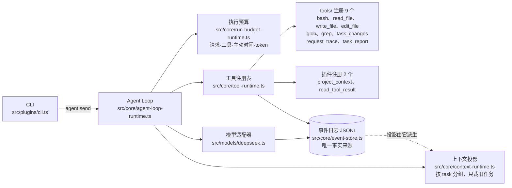

# mini-DSH

[](https://github.com/BeforeLanding/mini-DSH/actions/workflows/ci.yml)

仿 DeepSeek Harness 的 **mini coding agent harness**：用 TypeScript / Cordis 构建的本地编程 Agent 运行环境。开发主线是让模型在真实代码仓库里走完「理解项目规则 → 定位代码 → 修改文件 → 运行检查 → 根据失败修复 → 交付 diff 与验证证据」这条链路；上下文管理、执行预算、权限闸门与持久化恢复贯穿其中。

**范围**：单 Agent、单本地工作区、CLI 交互。核心依赖服务契约，不绑定具体模型或工具；DeepSeek 是首个模型适配器，MCP 只按可选外部插件接入。

**明确不做**——列在这里是为了不把应用层策略读成强保证：

- 多 Agent 调度与托管平台；
- 向量记忆与长期记忆；
- 操作系统级隔离。路径与命令闸门是应用层策略，不承诺消除外部竞态；
- 费用硬上限。货币预算不在范围内，[PLAN](docs/context-budget/PLAN.md) 里出现的金额只是实验规模的信息性上界，不是计费承诺；
- 任意执行位置的精确恢复。恢复是事件重建，不恢复文件系统快照。

按照 [从零手写 mini-dsh 学习指南](https://github.com/huangjunsen0406/mini-dsh/blob/main/LEARNING.zh-CN.md) 完成第 0～7 天主线及补充篇，每个阶段分别提交，随后扩展上下文、预算与持久化恢复。

当前已具备有界文件/Bash 工具与大结果回读、仓库规则与检查入口上下文、可靠编辑与可恢复的任务变更清单/diff、结构化验证与交付报告，以及可重跑的真实模型评测入口。完成状态以 [TASKS](docs/context-budget/TASKS.md) 与 [PROGRESS](PROGRESS.md) 为准。

## 基线与本项目的分界

本仓库的来源分两段，分界点是提交 `c5fc9c4`：它及之前是照着教程主线做的，`43e3829`（M0 文档基线）起是本项目自己的开发。把分界写出来，是为了让「哪些是教程已有的、哪些是本项目加的」可以核对，而不是靠印象。

| | 教程基线 | 本项目独立扩展 |
| --- | --- | --- |
| 提交范围 | `0a95a7f`～`c5fc9c4`（共 11 个） | `43e3829` 起 |
| 语言 | 纯 JavaScript | TypeScript（tsc strict / NodeNext），Node 执行 `dist` 产物 |
| 工具 | 6 个：`bash` + `read_file`／`write_file`／`edit_file`／`glob`／`grep` | 11 个：`tools/` 的 9 个（上列 6 个再加 `task_changes`／`request_trace`／`task_report`）与插件提供的 2 个（`project_context`／`read_tool_result`） |
| 测试 | 22 条（`core.test.js` 20 + `integration.test.js` 2） | 207 条；另有 16 项编程 fixture 基线、离线评测入口与三条演示 |
| 已有能力 | 基础配置、Session Event Log、Tool Runtime、System Prompt + LLM Adapter、Agent Loop、DeepSeek 适配器、runtime-context、外部插件与 MCP、沙箱与路径闸门、Bash/文件工具 | 上下文投影与裁剪、四维执行预算、JSONL 持久化与崩溃恢复、预算停止后的 `/continue`、有界读取/搜索与大结果回读、可靠编辑与任务变更清单、结构化前台命令、验证记录与交付报告、请求 trace、项目上下文、编程任务 fixture、真实模型评测 |

上表每一行都能在仓库根目录复现（全部离线，不联网）：

```powershell
git rev-list --count c5fc9c4                              # 11：教程主线提交数（含端点）
git ls-tree -r --name-only c5fc9c4 | grep -c '\.ts$'      # 0：基线没有 TypeScript
git ls-tree -r --name-only c5fc9c4 src/ | wc -l           # 22：基线源文件数
git show c5fc9c4:src/tools/files.js | grep -o "name: '[a-z_]*'"   # 5 个文件工具
git show c5fc9c4:src/tools/bash.js  | grep -o "name: '[a-z_]*'"   # bash
git show c5fc9c4:test/core.test.js        | grep -c '^test('      # 20
git show c5fc9c4:test/integration.test.js | grep -c '^test('      # 2
git log --oneline --reverse | sed -n '12p'                # 43e3829：分界之后的第一个提交
```

**没有的事**：本仓库里**不存在**「教程第 N 天 ↔ 某个 CB 编号」的映射，不必去对——上面那句「第 0～7 天主线及补充篇」是对教程本身的引用，粒度就到那里。

## 运行

需要 Node.js >= 20.18.1 和 pnpm 11.22.0。Windows 的 Bash 工具优先使用 Git for Windows 自带的 Bash；其他平台使用 PATH 中的 `bash`。已配置阿里云服务器的启动、自动发布和回滚操作见 [ECS 部署说明](docs/ECS_DEPLOYMENT.md)。

### 零密钥跑通

下面八条命令**不需要 `.env`、不需要任何密钥、不发出模型请求**，用来确认装配、回归、任务集、评测运行器与三条演示在本机成立。行尾注释是各命令的实际输出：

```powershell
pnpm install --frozen-lockfile
pnpm check            # syntax ok: 90 files
pnpm test             # tests 205 / pass 205 / fail 0 / skipped 0
pnpm fixtures:check   # 16 项：初始全部失败、参考解全部通过
pnpm eval:offline     # planned 12 / executed 12 / accepted 12
pnpm demo:fix         # 退出码 0：项目规则 → 定位 → 修改 → 失败测试 → 再修复 → diff 与证据
pnpm demo:resume      # 退出码 0：预算停止与同 task 恢复
pnpm demo:unknown     # 退出码 0：崩溃恢复里的 unknown 与陈旧锁
```

各条的覆盖面不同：`pnpm check` 只做类型、构建与产物语法；`pnpm test` **使用模拟模型驱动 Loop，但真实执行 Bash 与文件工具**；`pnpm fixtures:check` 逐项跑独立验收器并核对受保护文件未被改动；`pnpm eval:offline` 验证评测运行器与整批上限核算，它会自己打印一行 `note: 模拟模型驱动，用于验证运行器与整批上限；通过率不作为模型能力证据`。

这些命令的绿色**只说明 Harness 在本机成立，不代表真实模型的编程能力**——真实模型的结论见 [NX-08 评测报告](docs/context-budget/NX-08-REPORT.md)，且那里的结论受样本量与任务集天花板效应限制。

### 接真实模型

```powershell
if (-not (Test-Path .env)) { Copy-Item .env.example .env }
pnpm start
```

启动前在 `.env` 中填写 `DEEPSEEK_API_KEY`。`.env.example` 默认选择 `deepseek/deepseek-v4-flash`；未设置 `MINI_DSH_MODEL` 时选择 `deepseek/deepseek-v4-pro`。`MINI_DSH_WORKSPACE` 指定工作目录，默认是启动目录。Context7 为可选 MCP 服务，连接失败仍可进入 CLI。

CLI 支持 `/tools`、`/models`、`/model provider/model`、`/history`、`/prompt`、`/reset`、`/continue`、`/budget`、`/changes [fileOffset]`、`/diff [fileOffset] [byteOffset]`、`/report [fileOffset] [verificationOffset] [byteOffset]`、`/trace [requestOffset] [byteOffset]` 和 `/exit`。`/reset` 追加事件、清理可见历史并保留 session id 与原始 JSONL。运行或审批时按 Esc 取消，方向键不会触发取消。

写文件、编辑文件和执行 Bash 前会询问 `Allow this? [Y/n]`，空回车或 `y` / `yes` 同意。审批等待暂停主动时间，并有独立超时。`MINI_DSH_AUTO_APPROVE=1` 可用于受信任的测试环境。

CLI 默认 `MINI_DSH_PROFILE=coding`，要求检查相关代码与已有改动、保留用户变更、按目录规则工作并报告真实检查证据。设为 `general` 可使用原通用身份并关闭项目上下文插件；底层 runtime-context 插件仍默认 general。无效 profile 在启动时拒绝。

coding 模式从 `MINI_DSH_WORKSPACE` 至初始项目目录加载祖先链上的 `AGENTS.md`，父规则在前，返回路径、真实来源和目录作用域。初始目录由 `MINI_DSH_PROJECT_DIRECTORY` 指定，默认 `.`，必须在工作区内；这只是上下文目录，文件/Bash 的工作目录仍为工作区。模型修改其他目录前可用只读 `project_context({directory:"src"})` 查询该目录规则。每次组装和查询重新读取，不递归扫描仓库，缺失规则返回空列表。

项目配置选择最近的 package.json，展示包管理器、Node 要求及显式 test/check/typecheck/lint/build 入口；Git、TS、锁文件和 README 只发现路径标记。发现命令不会执行或安装，运行仍需 Bash 策略和审批；项目内容不能扩大 Harness 权限，run completed 也不代表检查通过。非 Git/缺失配置可继续，错误配置有来源和退化说明，不冒用父配置。

project-context 插件可通过 `limits` 配置 `maxFileBytes`（默认 16 KiB）、`maxContentBytes`（32 KiB）和 `maxDirectories`（16，包含工作区和目标）；均须为正安全整数。规则原文与元数据 JSON 共用内容字节预算，超预算元数据仅返回退化诊断；路径/诊断/提示词包装还会进入完整请求的 token 估算。规则超限、无效 UTF-8、非文件或越界明确失败，不注入残缺规则；完整 system 装不下时沿用 context_overflow 停止。

## 演示

三条零付费入口把 M9 要求的演示做成可直接运行的脚本，配合带 `AGENTS.md` 的 fixture `repair`（16 个 fixture 里唯一带项目规则的一个）。它们只用预设的脚本化模型（`scripted/demo`），不读 `.env`、不出网、不调用付费 API，因此逐字可复现；退出码 0 表示该幕的全部判定成立，任一判定不成立就退出 1 并点名。**绿色只说明 Harness 的行为符合预期，不代表任何模型能力。**

| 命令 | 展示什么 |
| --- | --- |
| `pnpm demo:fix` | 项目规则 → 定位 → 修改 → 失败测试 → 再修复 → diff 与证据 |
| `pnpm demo:resume` | 预算停止与同 task 恢复：被跳过的调用不会凭空消失，已完成的工具不会重放 |
| `pnpm demo:unknown` | 真崩溃之后的 unknown：工具已写、结果未落盘 |

`demo:fix` 的两条项目规则分居根目录与 `src/` 两个作用域，模型必须先查 `src` 才拿得到第二条；第一次只修好其中一条，公开检查因此仍然失败并把失败点名到另一条规则，第二次才通过。收尾打印 `task_changes` 的真实 diff 与 `task_report` 的覆盖/检查记录，并明确指出 `task_report` 的 `acceptance` 恒为 `not_asserted`——判定来自工作区之外、模型与 Harness 都看不到用例的独立验收。

`demo:resume` 的第一段把请求预算压到 4 次，第 4 次请求带回的那条编辑在**派发之前**被拦下，恢复后补做；判定逐条核对首段确实停止、被跳过的调用没有 `tool/start`、恢复后真的执行了一次、`continuations` 为 1、没有任何工具被执行两次。

`demo:unknown` 起一个子进程执行一条写下真实副作用文件后阻塞的命令，等文件出现后按进程树杀掉它，因此留在磁盘上的残局是真的。它同时暴露一个目前**没有**对应入口的步骤：崩溃留下的 `writer.lock` 会让 `JsonlStore.open` 直接拒绝（`session writer lock exists; verify stale locks explicitly`），而 `quarantineTail` 也要先抢同一把锁，所以恢复的唯一路径是由人确认 pid 已死、再显式删掉这把锁——CLI 也没有 `/recover`。演示照实做这一步并说明它属于操作者的判断，该缺口已立项 NX-21，本次未修。

三条演示的事件日志落在 `.demo-runs/`，与 `.eval-evidence/`（真实模型证据）分开存放，两者都不入库。

## 结构

入口负责装配插件；`core/` 实现事件日志、工具注册表、提示词、模型路由和 Agent Loop；`plugins/` 将 runtime 暴露为 Cordis 服务；`models/` 实现 DeepSeek 流式协议。工具分两处注册：`tools/` 提供 9 个（Bash、五个文件工具、`task_changes`、`request_trace`、`task_report`），插件再提供 2 个（`project_context`、`read_tool_result`），合计 11 个。



看这张图要看三件事：**请求**从 CLI 进 Agent Loop，再由 Loop 分发给投影、预算、模型与工具；**事件日志是唯一事实来源**，请求投影（虚线）是从它派生出来的视图，裁剪只作用于投影、不删原始事件；**工具在两处注册**——`tools/` 9 个与插件 2 个，合计 11 个。

Loop 通过服务契约工作，不依赖具体模型或工具，底层未注入预算时没有固定次数上限；CLI 默认使用有限预算。每个已记录的 tool_call 都保证有配对结果（真实完成、`skipped` 或 `unknown`）。

路径闸门检查词法路径、真实路径及尚未创建文件的父目录，拒绝软链越界。命令策略用于防止误操作，审批负责确认执行；这是应用层策略，不是操作系统隔离。命令策略按 shell 语义分词后检查越界路径、系统路径、危险删除与出网目标，并把 shell **真正会执行**的嵌套文本一并检查——单引号之外的 `$(...)` 与反引号、`sh`/`bash`/`zsh`/`dash`/`ksh` 的 `-c` 参数（含 `env`/`nice`/`xargs` 包装）、`eval` 的参数，都按独立片段递归检查；取网工具集含 `curl`/`wget`/`nc`/`ssh`/`scp`/`rsync`/`ping`/`dig` 等。惰性参数不拦（注释形状的 `//`、`echo`/`printf` 参数里的 URL、单引号内的 `$(...)`）。它是形状启发式而不是完备解析：`node -e`/`python -c` 的程序字符串、脚本文件内容、base64 解码后进 shell 与未列入清单的工具都不在覆盖内，详细契约与边界见[需求 R-20](docs/context-budget/REQUIREMENTS.md)。

## 验证

```powershell
pnpm check
pnpm test
```

当前 207 条测试，保留原 22 条核心/Cordis 回归，并增加预算、容量、持久化、恢复、续跑、CLI、项目上下文、有界工具/结果回读、可靠编辑/任务变更、结构化命令、验证报告与请求 trace 测试。集成测试使用模拟模型，但实际执行 Bash，并验证文件工具、工具卸载和可选/必需插件的失败行为。测试不需要 API Key。

NX-05a 起提供可重复的 [编程任务 fixture](test/fixtures/coding/README.md)，NX-05b 扩展到 12 项，覆盖边界修复、功能扩展、跨文件接口修改、去重、分页、查询重试、合并、CSV、库存与汇总等；此后又加入多阶段序列 `pipeline`、单任务 `audit`、演示夹具 `repair`，以及 `pipeline` 的无公开检查变体 `blind`，**当前注册表共 16 项 = 筛查 12 项（上列，冻结）+ 这 4 项**（`blind` 与 `pipeline` 是同一套任务，只差工作区里有没有公开 `check.mjs`）。运行 `pnpm fixtures:check` 核验全部 16 项的初始失败/参考通过基线；`pnpm test` 还覆盖模拟模型经真实文件/Bash 工具完成失败→修改→重跑的流程。每次使用新临时工作区，独立验收器保留在工作区外；模拟结果不代表真实模型编程成功率。

`pnpm eval:offline` 用模拟模型把 12 个 fixture 跑成一次筛查阶段，用于验证评测运行器与整批上限核算（单次 run 预算与按阶段计数的整批上限见 [PLAN](docs/context-budget/PLAN.md#nx-08-评测批次上限预注册)）。该命令同样不使用真实模型，通过率不作为模型能力证据。

`pnpm eval:screening` 与 `pnpm eval:sequence` 是**会真实计费**的评测入口：前者跑筛查批次的 12 个单任务 fixture，后者跑多阶段 fixture `pipeline` 的诊断烟测（同一会话内按序下发的十四个阶段，用于测量上下文裁剪在哪个阶段被触发）。两者都需要 `.env` 里的 `DEEPSEEK_API_KEY`，按 `--phase` 选择批次；先加 `--plan-only` 可以在不建目录、不出网、不需要密钥的情况下核对「这次要跑什么、上限多少、证据落在哪」。`--tasks` 只能取当前阶段清单内的子集。三个与评测相关的环境变量见 [.env.example](.env.example)。

`pnpm eval:estimate` 打印输入估算器与 DeepSeek 官方离线 tokenizer 的偏差分布（语料与固定参考值见 [test/fixtures/estimation](test/fixtures/estimation/README.md)）。结论：对中文、英文一致高估；对代码与 JSON 不是一致安全，实测有样本低估超过 10% 的容量余量。估算器或语料变化时该命令以非零退出码提示重新测量，不静默沿用旧结论。

GitHub Actions 在推送到 `main`、提交 Pull Request 或手动触发时运行 CI，覆盖 Ubuntu / Windows 和 Node.js 22 / 24。工作流按 `package.json` 固定的 pnpm 版本安装依赖，使用 `--frozen-lockfile`，然后运行 `pnpm check` 和 `pnpm test`，无需 DeepSeek 或 Context7 密钥。

`pnpm lint` 暂未作为 CI 门槛：当前代码尚未通过 Biome 的格式与规则检查，统一规范后可再加入。

若编码 Agent 的受限沙箱内出现 pnpm 版本引导失败或 Cordis `ERR_MODULE_NOT_FOUND`，先在正常用户终端核验 `pnpm --version` 与上述安装/检查命令。依赖目录可能存在但沙箱无法访问；确认实际安装问题后再修复，保持固定 pnpm 版本和锁文件校验。当前本地恢复结果见 [PROGRESS.md](PROGRESS.md)。

## 真实模型实验

2026-09-30 至 10-01 用同一个模型 `deepseek/deepseek-v4-flash` 跑了四批真实调用。读者面向的报告是 **[NX-08 评测报告](docs/context-budget/NX-08-REPORT.md)**，逐步证据在 [CHANGES](docs/context-budget/CHANGES.md)，参数与预注册口径在 [PLAN 的评测批次上限](docs/context-budget/PLAN.md#nx-08-评测批次上限预注册)。本节只是摘要，以报告为准。

| 实验 | 规模 | 运行数 | 结果 |
| --- | --- | --- | --- |
| 筛查跑 | 12 个单任务 fixture × 1 次 | 12 | 12/12 通过独立验收 |
| 对照 A | 1 条十四阶段序列 × 3 次重复 × 2 臂 | 6 | 6/6 通过；两臂差异只有输入目标 |
| 对照 B | 1 个单任务 fixture，两次烟测 | 2 | 都完成并通过验收，但**自变量未被触发** |
| 无公开检查变体 | 1 个十四阶段 fixture `blind`，1 次诊断烟测 | 1 | 通过验收，**未观测到失败**；4/14 个阶段被输入目标截停 |

筛查与对照 A 两批共 18 次运行**零基础设施失败、零人工介入**，四批实验的不可行项都是 0；usage 全部来自 provider，估算回退一次都没发生。

**链路可用，能力结论不写。** 两处通过率测量都取满值（筛查 12/12、对照 A 6/6），**方差为零**——不是「差异很小」，是「量不出来」，因此以通过次数为分子的任何统计量在此规模下都没有分辨力。机制见 [NX-08g0](docs/context-budget/CHANGES.md#nx-08g0-任务集天花板效应定性边界与补救排序)：工作区里有公开且受保护的 `check.mjs`，十四个阶段的说明又全都以「完成后运行 `node check.mjs N`」结尾，模型不必一次写对、只需能收敛到绿——它确实是这么做的。**打破它的方案 2 已由 [NX-08h](docs/context-budget/PLAN.md#nx-08h-无公开检查变体blind) 执行**：新 fixture `blind` 去掉工作区里的公开 `check.mjs`。**结果是这一次没有观测到失败**——终态独立验收通过、零 `max_steps`，按该次预注册的三条判据字面命中「未被打破」。**不能读成「无公开检查不影响结果」**：未观测到差异不等于没有差异，且总共只有 1 次运行。这次还留下两件事：**4/14 个阶段以 `context_overflow` 结束**（当前任务裁无可裁之后仍越过输入目标 65,536——该次预注册的判据只防了 `max_steps`，是它的缺口，判据正文未回改）；以及模型**自己写检查脚本补上了 oracle**（`tmp-verify-NN.mjs`，117 次 bash 里 31 次是 `node` 内联脚本，而提到 `check.mjs` 的是 0 次）。本段的 12/12 与 6/6 二字未动。

**对照 A 的处理确实生效，但它省下的是上下文规模。** 裁剪臂三次的首次裁剪落在第 8／6／6 个阶段、受处理阶段 7／9／9（共 14）；末阶段峰值估算输入两臂相差 2.65 倍。但两臂的请求数几乎持平、墙钟反而略长——**省的是上下文规模，不是步数或时间**。token 正是这个处理直接改变的指标，属操纵检查，不能当结局。

**对照 B 是负面结果：仪器没有成立。** 有界工具输出这个自变量在两次烟测里都没被触发——模型两次都没有在破损状态下跑过那份会产生大输出的报告，而是改用 `read_file` 分块或自写 `node -e` 探针，把大数据**在工具进程里**降维成小摘要，峰值估算输入都不到输入目标的一半。**这不能读成「有界工具输出没有价值」**：那是这台仪器没测到，不是处理无效，且两次运行落在同一侧。要重测得换一类**无法被脚本降维**的任务，那是新仪器与新契约。

**两条独立的限制**，不可互相替代，报告里分列：结局饱和（被估计的量失去取值）与样本量小（只有 1 条 fixture 序列，区间宽度无意义）。

**真实模型结果与模拟回归是两回事。** 上表是真实调用；`pnpm test`、`pnpm fixtures:check`、`pnpm eval:offline` 都走模拟模型，只说明 Harness 在本机成立。

成本约 $6.44（筛查 $0.15 + 对照 A $4.81 + 对照 B 两次烟测 $0.05 + 无公开检查变体 $1.43），按价格页直接计算、未假设缓存命中，因此不是计费承诺。

## 开发协作

围绕 mini coding agent harness 的 [完成度评估与开发路线](docs/INTERNSHIP_ROADMAP.md) 包含三个已复现边界、仓库上下文、可靠编辑、执行验证、编程评测和求职展示；具体完成状态以 TASKS/PROGRESS 为准。

**「事件与投影分离、协议完整性、可靠编辑、验证时效、未知副作用恢复」这五条选择的替代方案、代码锚点与测试锚点**整理在 [设计取舍](docs/context-budget/DECISIONS.md)——每节回答「替代方案会怎么坏、这件事在哪几行代码上成立、哪个测试在它被改回去时会红」。它是 [PLAN](docs/context-budget/PLAN.md) 的非规范性说明：决策编号与全部数值仍以 PLAN 为准。

## 可靠编辑与任务 diff

read_file 在编辑限额内返回完整字节 SHA-256；edit_file/write_file 可传 expectedHash，新建用 missing。编辑保持 Unicode/BOM/CRLF，拒绝重复 oldText、二进制、非法编码和超限；审批展示范围、指纹和有界 diff。审批期间变更或软链重新指向会拒绝，文件通过同目录临时写入、sync 和 rename 替换并保留原权限。最终核验至 rename 仍存在外部进程竞态，这是乐观冲突检测，逐文件提交，不承诺跨文件事务。

有 session 时，首次读取/编辑前的现场内容作为 task 基线，保留用户原有 staged/dirty 修改；未传 expectedHash 时也检查最近观察/成功编辑版本。冲突后重新读取再编辑。基线、观察指纹、意图和逐次结果保存到原 JSONL；重启和 /continue 不重放编辑，结果未确认显示 unknown，须人工核验后开始新任务。无 session 直接调用仍可用指纹保护，但不产生任务清单。

运行结束自动展示清单；/changes 查看逐文件状态、失败次数和外部变化，/diff 查看已确认编辑，截断时给出文件/UTF-8 字节续读命令。task_changes 给模型同样的清单及 diff，大结果继续使用结果引用回读。两次编辑间的用户修改只标记来源断层并改为逐次编辑 diff，不将它们归到 Agent；Bash 和外部工具修改不在此清单覆盖范围。

files 插件 maxEditBytes 默认 1 MiB、maxTrackedFiles 默认每 task 100，均可配置。超限文件仍可有界读取但无编辑指纹；不可直接编辑。CLI maxChangeOutputBytes 默认 32 KiB（至少 4 字节），/diff 每次展示一个文件并可分页，/changes 默认每页最多 20 个文件。快照包含相关文件内容，作为本地 session 数据保存，勿提交真实用户日志。

本轮 TypeScript、持久化、上下文、预算及续跑功能的完整梳理见 [改动与实现功能](docs/context-budget/CHANGES.md)。

开发前阅读 [AGENTS.md](AGENTS.md) 与 [PROGRESS.md](PROGRESS.md)。上下文与执行预算管理的开发基线由[需求与验收](docs/context-budget/REQUIREMENTS.md)、[计划、设计与参数](docs/context-budget/PLAN.md)和[任务清单](docs/context-budget/TASKS.md)组成；TypeScript、持久化、上下文/执行预算及继续功能已实现，验收证据见任务清单与进度。

## TypeScript 开发

源码、配置与测试使用 TypeScript（strict / NodeNext）；相对导入使用 `.js`。`pnpm typecheck` 检查类型，`pnpm build` 先校验后清理并编译到 dist，`pnpm check` 检查类型、构建和产物语法，`pnpm test` 构建后运行编译测试，`pnpm start` 构建后启动。plugins.config.ts 编译到 dist 根目录；cwd 与 .env 语义不变。scripts 的 Node 引导程序保留 JavaScript，不依赖类型剥离。

## 预算、持久化与续跑

终态提交确认也计入主动预算，另有 `finalizationTimeoutMs`（默认 5000ms）控制收尾上界。超时或取消不会返回成功；若终态已开始写入而无法及时确认，`/budget` 显示 `terminalCommit.status=uncertain`，必须关闭并恢复 session 核验日志后才能继续。迟到写入不会更改当前进程的停止状态；恢复遵循实际完整落盘的唯一终态。终态事件计时是提交前快照，当前进程的主动时间观测包含提交等待。

CLI 默认每段模型请求64次、工具128次、主动10分钟、累计2M token，输入目标64Ki、最大输出16Ki、最低输出预留4Ki。容量余量为 max(2048,input估算10%)。模型请求180秒，审批300秒；Bash保留30秒。用 `.env` 中 `MINI_DSH_BUDGET` JSON 或 `/budget {"maxModelRequests":8}` 覆盖，`/budget` 查看有效配置、最近run、任务累计、估算来源和裁剪任务ID。次数/总额0表示零额度；输出和容量必须为正整数。

默认写入 `~/.mini-dsh/sessions/<sessionId>/events.jsonl`，CLI打印session ID；可用 `MINI_DSH_SESSION_DIR` 改目录，设置 `MINI_DSH_SESSION_ID` 在同一规范化工作区恢复。单写入者持锁；正常退出等待写入并释放锁。失效writer.lock需人工确认旧进程与副作用后处理；不会仅凭PID自动解除。尾部半条事件拒绝恢复；可在核验后调用 `JsonlStore.quarantineTail(directory,id)` 保存原日志并隔离尾部，中部损坏或未知版本明确报错。

停止后 `/continue` 关联同一task的新run，沿用有效额度并累计任务用量，不复制用户输入、不重放已完成或未知工具。completed不继续；context_overflow需先调整上下文配置；unknown需先人工核验副作用，再开始明确的新任务，自动续跑会拒绝。`/model` 和 `/budget` 设置追加到日志，恢复保留，reset清理任务并保留当前配置。

上下文只在请求投影中移除最旧完整任务；system、安全规则和当前task所有run保留，装不下时context_overflow。Token估算用ASCII0.3/其他Unicode1.0，加消息32/请求256开销；provider usage优先，缺失/中断记estimated和uncertain，不当作零或精确账单。估算误差可能让实际消耗超额度，后续调度仍会停止。自定义模型/端点须显式提供contextWindowTokens；官方DeepSeek能力由适配器元数据提供，不根据任意模型名猜容量。

不遵守AbortSignal的第三方工具可能在停止等待后继续执行，其结果标unknown。恢复是事件重建，不能恢复文件系统快照。测试使用模拟模型，不调用付费API。

## 结构化前台命令（NX-14）

`bash({command:"pnpm test",cwd:"apps/web"})` 在工作区内现存目录执行，cwd 默认 `.`；审批展示真实目录，审批后复查路径和软链。返回 JSON：type=command、version=1、command、cwd、status、exitCode、signal、durationMs、timedOut/cancelled，以及分别采集的 stdout/stderr。status 为 exited/spawn_error/timed_out/cancelled；启动失败没有退出码，拒批和路径拒绝不会启动进程。

非零退出、启动失败、超时和取消都标为工具错误并保留已采集日志。默认 timeoutMs=30000、maxCaptureBytes=8 MiB（两流合计），可由 Bash 插件配置；计时不含审批。截断后继续排空输出，UTF-8 不完整尾部舍弃，非法字节替换解码。首版用于有界前台命令，后台服务与交互终端仍待后续实现。

有 session 和 tool-results 插件时，每流超过 maxPreviewBytes/2 的日志保存独立引用；stdout/stderr.text 是预览，bytes 是采集字节数，truncated 表示采集截断，previewTruncated 表示预览截断，ref/storedBytes/storageTruncated 表示持久日志位置与存储截断。用 `read_tool_result({ref:result.stderr.ref,offset:0})` 回读原始 stderr。退出码、状态等元信息始终保留，存储失败提供 storageError 和有界预览并标工具错误；不会把日志不可用描述成检查成功。

取消会终止进程树，直接工具调用在 close 后返回 cancelled；若 run 的取消/主动超时已先停止等待，事件仍按既有协议记 unknown，重启不自动重跑。取消 signal 不被绕过以保存新日志。进程组/taskkill 清理不等于操作系统隔离，主动脱离进程树的程序和外部路径竞态仍是应用策略限制。命令退出 0 与 run completed 均不代表任务验收；显式验证与交付查询见 NX-15。

## 编程验证与交付报告（NX-15）

用 `bash({command:"pnpm test",verification:{files:["src/example.ts","test/example.test.ts","package.json"]}})` 显式记录一次检查。files 相对工作区根，与命令 cwd 无关；需包含此次检查依赖的源码、测试和配置。默认最多 100 文件、每个 1 MiB，通过 Bash 插件的 maxVerificationFiles/maxVerificationFileBytes 配置；支持有界 UTF-8 普通文件和 missing，超限/二进制/非法路径明确失败。普通 Bash 不自动识别为测试或验证。

审批展示命令、cwd 和文件范围；批准后读取 SHA-256 与真实位置，verification/start 确认落盘后再执行，执行前重新核验 cwd。verification/result 记录有界原始命令结果及检查后版本。拒批或意图写入失败不启动命令；结果未确认、取消前未启动或崩溃留下 unknown，恢复不会重新执行。取消后的版本读取不绕过 signal；真实命令结果可持久化，后版本明确不可用。验证事件保留有界日志，原 Bash 输出仍支持 NX-14 的逐流引用；交付摘要不重复日志。

模型调用 `task_report({fileOffset:0,verificationOffset:0,maxFiles:20,maxRecords:20})`；CLI 用 `/report [fileOffset] [verificationOffset] [byteOffset]`，运行结束也展示报告。文件与检查独立分页，按返回的 next offset 或 CLI 提示续读；正文默认使用 maxChangeOutputBytes 的 32 KiB 上界，UTF-8 截断提供字节续读提示。分页重新读取当前文件，期间文件变化时不是固定快照。`/changes` 与 `/diff` 保留。

报告分别显示 runStatus、checks 的 status（passed/failed/unknown/stale/unavailable）与 freshness（current/stale/unavailable）、文件工具变更及未覆盖文件。passed 表示命令成功且声明文件检查前后版本一致；之后声明的任一文件变化或文件工具再次应用修改（即使改回原字节）使证据过期。文件覆盖从同 task 全部已确认检查计算，报告仍保留失败历史；未覆盖列表只对应当前文件页，须检查所有页。记录跨续跑/重启保存，reset 隔离。

报告的 acceptance 始终是 not_asserted：显式文件和命令证据不自动证明任务验收。未声明的依赖、目录新增、检查中修改后恢复、文件工具之外的修改归因及外部文件竞态均不在完整保证内；Bash/external 编辑不计入文件工具变更清单。无显式检查时明确未验证。未调用付费模型；87360a1 的 [CI 36653379987](https://github.com/BeforeLanding/mini-DSH/actions/runs/36653379987) Ubuntu/Windows × Node22/24 四组合通过，每组 check72/test123/123，无失败或跳过，这是 NX-15 历史证据。NX-05b 将 fixture 扩为 12 项，初始 0/12、参考 12/12；补齐单文件、多文件、大日志定位与预算续跑各三项后，本地全量测试 147/147，精确 SHA 53e5aba 的 [CI 36657576782](https://github.com/BeforeLanding/mini-DSH/actions/runs/36657576782) 四组合通过。[任务集说明](test/fixtures/coding/README.md) 与 TASKS/PROGRESS 记录实际边界及提交证据。

## 请求 trace 与编程结果报告（NX-06）

模型调用 `request_trace({requestOffset:0,maxRequests:20})`，CLI 使用 `/trace [requestOffset] [byteOffset]`。trace 按当前 task 的已确认模型请求分页，关联 session/task/run/request、模型、上下文投影、provider 或 estimated usage、完成状态、工具结果分类及 file change/verification 证据 ID。重复 toolCallId 按请求区间隔离；提示词、推理、工具参数、结果正文和命令日志不会复制进摘要，完整原始审计仍使用 `/history`。

`task_report` 在 NX-15 的文件 hash、检查版本和命令结果摘要之上，增加 session/currentRun、每个续跑段的模型、状态、停止原因、counters/usage，以及任务累计用量。running 只表示已确认事件中尚无终态；completed 仍不等于代码验收，acceptance 保持 not_asserted。trace、文件和验证分页都会重新读取当前事件/文件，不是固定快照；CLI 输出受 maxChangeOutputBytes 限制并支持 UTF-8 字节续读。

NX-06 本地 `pnpm check`、150/150 回归及 12 项 fixture 基线通过；最终功能提交 08158b9 的 [CI 36661121345](https://github.com/BeforeLanding/mini-DSH/actions/runs/36661121345) 在 Ubuntu/Windows × Node22/24 四组均通过。测试均使用模拟模型，未调用付费 API。

## 有界读取、搜索与日志回读（NX-07）

模型可调用 read_file({path:"src/index.ts",startLine:1,maxLines:100}) 获取带行号的片段，按 nextLine 继续。默认最多 200 行、正文 32 KiB、扫描 8 MiB；长行、非法 UTF-8 和二进制明确失败，扫描上限需通过插件配置调整。glob/grep 返回 matches、nextOffset、eof、reason 和 skipped；例如 grep({path:"src",query:"register",pattern:"**/*.ts",maxResults:50})，后续传 offset=nextOffset。分页会重新扫描，文件变化时不是快照；达到条目/深度/扫描上限时应缩小 path/pattern。默认忽略 .git/node_modules/dist/.mini-dsh，includeIgnored=true 可显式包含；软链不递归跟随。

CLI 默认装配 tool-results 插件。普通工具结果超过 16 KiB 时只把预览与 UUID ref 送入模型和 JSONL；Bash 按上述逐流规则保存引用。用 read_tool_result({ref,offset:0,maxBytes:16384}) 回读，再传 nextOffset，直到 eof。完整采集内容存于工作区 .mini-dsh/tool-results，按 session 校验；重启后须保留同 session 和结果目录。回读本身不会生成新引用，无 session 的底层 ToolRuntime 调用保持原行为。Bash 采集默认最多 8 MiB，超过时明确标记；结果存储也限制 8 MiB，captureTruncated=true 表示存储未保留完整采集内容；Bash 原始采集截断另见 stream.truncated。

files 插件可配置 maxLines/maxOutputBytes/maxScanBytes/maxResults/maxEntries/maxDepth/maxFileBytes；tool-results 可配置 directory/maxPreviewBytes/maxCaptureBytes/maxStoreBytes/maxFiles/maxReadBytes，Bash 可配置 maxCaptureBytes。默认搜索上限为 200 匹配、10000 条目、64 层、单文件 1 MiB、累计 8 MiB。存储默认总额 64 MiB、1000 文件，按单实例串行检查额度；多进程共享目录没有全局配额锁。存储满、损坏或缺失会明确失败，不自动删除历史。正文/匹配预算不含有界元数据和 JSON 包装，包装仍计入请求预算。结果目录已加入 .gitignore；应用层路径检查不提供操作系统隔离。
